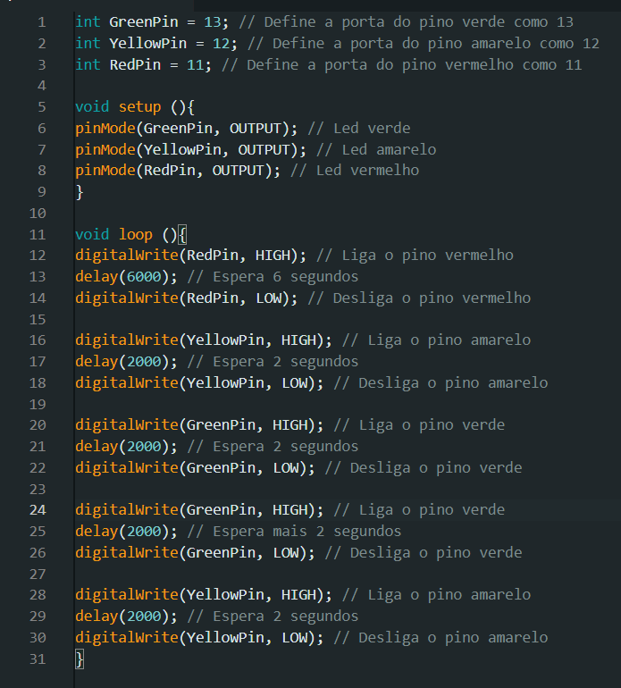

# Relatório de Montagem e Programação do Semáforo Offline - Semana 3

## 1. Montagem Física do Semáforo
### 1.1 Separação dos Componentes
&nbsp;&nbsp;&nbsp;&nbsp;Para a montagem do semáforo, foram separados os seguintes componentes:

| Componente | Quantidade | Função |
|------------|------------|--------|
| Arduino Uno | 1 | Controlar, enviar e receber informações |
| LED Vermelho | 1 | Representa o sinal vermelho |
| LED Amarelo | 1 | Representa o sinal amarelo |
| LED Verde | 1 | Representa o sinal verde |
| Resistor 150Ω | 3 | Proteção para os LEDs |
| Estrutura de MDF | 1 | Suporte fornecido durante a aula |
| Fios Jumper Macho-Macho | 4 | Conectar portas aos LEDs (via resistores na protoboard) e ao GND |
| Fios Jumper Macho-Fêmea | 3 | Conectar os LEDs (suspensos na estrutura de MDF) à protoboard |
| Protoboard | 1 | Plataforma para montagem física dos componentes |

 

### 1.2 Montagem do Circuito
&nbsp;&nbsp;&nbsp;&nbsp;Com os componentes separados, a montagem foi realizada em sala de aula, conforme orientação do professor. O processo de montagem pode ser visto no vídeo abaixo:

[Vídeo da Montagem](https://drive.google.com/file/d/1IDNK6YTA-bvOGyr-ITkdtQEtgb5rvNcA/view?usp=drive_link)

&nbsp;&nbsp;&nbsp;&nbsp;As etapas para a montagem foram as seguintes:
1. Conexão do GND na protoboard (por meio de um fio macho-macho).
2. Posicionamento dos LEDs na estrutura de MDF.
3. Conexão dos jumpers macho-fêmea em cada LED (vermelho, verde e amarelo), ligando eles à protoboard.
4. Conexão das portas aos LEDs (com resistores para proteção na protoboard), usando jumpers macho-macho.

  

## 2. Programação e Lógica do Semáforo
### 2.1 Lógica estipulada

&nbsp;&nbsp;&nbsp;&nbsp;A lógica de funcionamento do semáforo foi programada com a seguinte sequência de cores e tempos:

| Cor  	| Tempo (segundos) |
|----------|-------------------|
| Vermelho | 6 |
| Amarelo  | 2 |
| Verde	| 2 |
| Verde	| +2 (tempo extra para pedestres) |
| Amarelo  | 2 |

 

## 2.2 Código desenvolvido
&nbsp;&nbsp;&nbsp;&nbsp;O código desenvolvido para controlar esse ciclo foi implementado na IDE do Arduino:

  Figura 1 - Código no Arduino IDE
  
   

  [Clique aqui](./code.cpp) para acessar o arquivo do código

&nbsp;&nbsp;&nbsp;&nbsp;No código, os valores das portas foram armazenados no `GreenPin`, `YellowPin` e `RedPin` a fim de facilitar a troca de portas dos LEDs. Além disso, foi utilizado o `digitalWrite()` para ligar e desligar os LEDs (`HIGH` para ligado e `LOW` para desligado). Já a função `delay()` foi usada para controlar o tempo de cada sinal (medido em milissegundos).

  

## 3. Avaliação em Pares

### 3.1 Primeira Avaliação: Rafael Rocha Barbosa
**Pontuação Total: 10/10**

- **Montagem Física (4/4):** Realizada com cores corretas, fios bem organizados e resistores adequados.
- **Temporização (3/3):** Configuração de tempos testada e validada com temporizador externo.
- **Código (3/3):** Implementação correta das fases do semáforo com boa estrutura de código, variáveis representativas e comentários explicativos.

**Observação:** Montagem física bem organizada; o uso de fios de cores variadas facilitou a compreensão das conexões.

 

### 3.2 Segunda Avaliação: Gustavo Gonçalves da Costa
**Pontuação Total: 10/10**

- **Montagem Física (4/4):** Cores e disposição dos fios organizadas; resistores corretamente utilizados.
- **Temporização (3/3):** Temporização verificada com timer de celular para garantir precisão.
- **Código (3/3):** Código implementado com fases corretas, transições adequadas e comentários claros e representativos.

**Observação:** Código comentado de forma clara e concisa, facilitando a compreensão das funções.